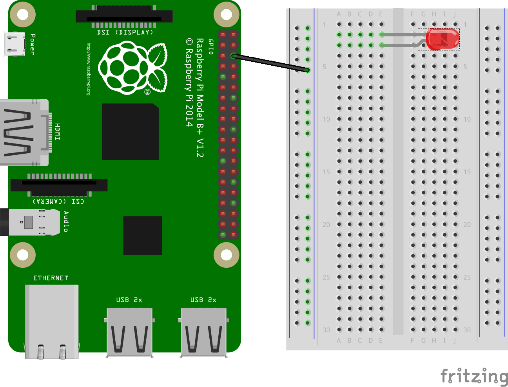
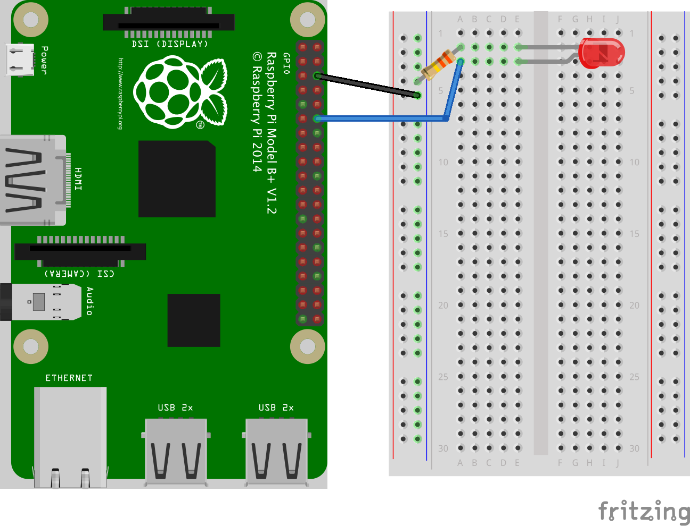

# Connecting and controlling an LED with Python

In this circuit, you will be connecting an LED to the GPIO header of your Raspberry Pi and using Python to turn it on and off.

1. Beign by looking at the following GPIO diagram and comapre it to your Raspberry Pi. 

    *GPIO stands for **General Purpose Input Output**. It is a way in which the Raspberry Pi can control and monitor the outside world by being connected to electronic circuits.  The Pi is able to control LEDs, turning them on or off, or motors, or many other things.  It is also able to detect whether a switch has been pressed, or temperature, or light.*

    You'll be using a single ground pin (marked `GND`) and several GPIO pins (marked `GPIO`):

|            |            |
|-----------:|:-----------|
|    3V3     | 5V         |
|  **GPIO2** | 5V         |
|  **GPIO3** | GND        |
|  **GPIO4** | **GPIO14** |
|        GND | **GPIO15** |
| **GPIO17** | **GPIO18** |
| **GPIO27** | GND        |
| **GPIO22** | **GPIO23** |
|        3V3 | **GPIO24** |
| **GPIO10** | GND        |
|  **GPIO9** | **GPIO25** |
| **GPIO11** | **GPIO8**  |
|        GND | **GPIO7**  |
|        DNC | DNC        |
|  **GPIO5** | GND        |
|  **GPIO6** | **GPIO12** |
| **GPIO13** | GND        |
| **GPIO19** | **GPIO16** |
| **GPIO26** | **GPIO20** |
|        GND | **GPIO21** |

Note that if you have an older Raspberry Pi model you'll only have 26 pins but they have the same layout, starting at the top row (`3V3` and `5V` and ending at `GND` and `GPIO7`).

You are going to connect your Raspberry Pi to a breadboard to allow you to build a circuit.

*Using a breadboard allows you to connect electronic components to each other without having to solder them together. They are often used to test a circuit design before creating a Printed Circuit Board (PCB). The holes on the breadboard are connected in a pattern. With the breadboard in the CamJam EduKit, the top row of holes are all connected together – marked with red dots.  And so are the second row of holes – marked with blue dots and we call this the ground rail.  The same goes for the two rows of holes at the bottom of the breadboard. In the middle, the columns of wires are connected together with a break in the middle.*

1. Take a black female to male jumper wire and connect the female end to a ground GPIO pin on the Raspberry Pi. Push the other end of the jumper wire into a hole on the ground rail on your breadboard like so:

    

1. Now take a red colour LED and have a look at it. Note which leg is longer than the other.

    *LED stands for Light Emitting Diode, and glows when electricity is passed through it. It has one leg longer than the other. This is important as it tells us which way round the LED should be placed into a circuit in order for the current to flow through it and make it work. The longer leg (known as the ‘anode’), is always connected to the positive supply of the circuit. The shorter leg (known as the ‘cathode’) is connected to the negative side of the power supply, known as ‘ground’.*

1. Push the long leg of the LED into a hole on the 'e' row of the breadboard e.g. e3 and the shorter leg into a hole next to it on the same row e.g. e2 like this:

    

1. Locate a resistor and take a closer look at it.

    *Resistors are a way of limiting the amount of electricity going through a circuit; specifically, they limit the amount of ‘current’ that is allowed to flow.  The measure of resistance is called the Ohm (Ω), and the larger the resistance, the more it limits the current.  The value of a resistor is marked with coloured bands along the length of the resistor body. In this circuit a 330Ω should provide enough resistance so that too much current does not overpower the LED.*

1. Connect one leg of the 330Ω resistor into a hole on the ground rail and the other leg into hole on the breadbord that lines up to the shorter leg of your LED e.g. a2. It does not matter which way around the resistor goes. You will need to bend the legs of each of the resistors to fit, but please make sure that the wires of each leg do not cross each other.

    

1. Now you need to complete the circuit in order for current to flow around it from the Raspberry Pi to light up the LED. To do this you are going to use another jumper wire.

    *Jumper wires are used on breadboards to ‘jump’ from one connection to another.  The ones you will be using in this circuit have different connectors on each end.  The end with the ‘pin’ will go into the Breadboard.  The end with the piece of plastic with a hole in it will go onto the Raspberry Pi’s GPIO pins.*

    Take a red female to male jumper wire and connect the female end to `GPIO 18` on your Raspberry Pi. This is the pin located 3 pins down from where you connected the black jumper wire to a `GND` pin. Then push the male end of the jumper wire into a hole on the breadboard that lines up with the longer leg of the LED e.g. a3

    

1. With your circuit complete, you are now ready to write some code to switch the LEDs on. Boot your Raspberry Pi, login and type `startx`.

1. Click on the **Terminal** application icon on the taskbar or click on the **Menu** followed by **Accessories** and then select **Terminal** with your mouse pointer. The icon for **Terminal** looks like this:

    

    Once loaded type `sudo idle3 &` and press enter on the keyboard. This will load the Python 3 programming environment called `IDLE3` as the super user which allows you to create a program that affects the GPIO pins. Once loaded click on **file** and **new window**.

1. Save the file by clicking on **file** and **save as**. Name your file `led-on-off.py`.

1. Next type the following code:

    ```python
    import time
    import RPi.GPIO as GPIO
    GPIO.setmode(GPIO.BCM)
    
    GPIO.setwarnings(False)
    GPIO.setup(18,GPIO.OUT)
    ```
    *The first two lines tells the Python interpreter (the thing that runs the Python code) that it will be using a ‘library’. You will need the `time` library in order to add timings to your program and the `RPi.GPIO` library that will tell the Pi how to work with the Raspberry Pi’s GPIO pins. A ‘library’ gives a programming language extra commands that can be used to do something different that it previously did not know how to do. This is like adding a new channel to your TV so you can watch something different. Each pin on the Pi has several different names, so you need to tell the program which naming convention is to be used in the second line of the code. The final line tells Python not to print GPIO warning messages to the screen.*
    
1. Underneath type:

    ```python
    print("Light on")
    GPIO.output(18,GPIO.HIGH)
    ```
    *The `print` function prints some information to the terminal. This is handy as it tells you what is happening, so that even if you LED doesn't come on you know that your program is working. If that happens then there might be something wrong with the wiring of your circuit and you should go back through the steps above to check.*
    
    *The next line turns the GPIO pin 18 ‘on’. What this actually means is that this pins is made to provide power of 3.3volts. This is enough to turn the LED in your circuit on.*
    
1. The code so far will turn on the LED, let's add some code to turn it off after a period of time. Below type:

    ```python
    time.sleep(3)
    print("Light off")
    GPIO.output(18,GPIO.LOW)
    ```
    *The first line adds a pause or sleep. It tells the program to sleep for 3 seconds before moving onto the next line in the sequence of code. During this time your LED will be on because you have not told it to do anything else yet. To turn the LED off, you add a line similar to the one that turned GPIO pin 18 on by making it high, instead you replace GPIO.HIGH with GPIO.LOW. This will turn the pins off so that they no longer supply any voltage.*

1. The final part to add to your program is:

    ```python
    GPIO.cleanup()
    ```
    
    *The GPIO.cleanup() command at the end is necessary to reset the status of any GPIO pins when you exit the program. If you don’t use this, then the GPIO pins will remain at whatever state they were last set to.*

1.	Save your code by clicking on **file** and **save**.

1. It is now the moment of truth! Click on **run** and **run module** to execute (or run) your code. 

## What's next?

Using the circuit diagram below see if you can add the other two LEDs, along with resistors to your circuit. You can use GPIO pins `GPIO 23` for the amber LED and `GPIO 24` for the green LED. 
