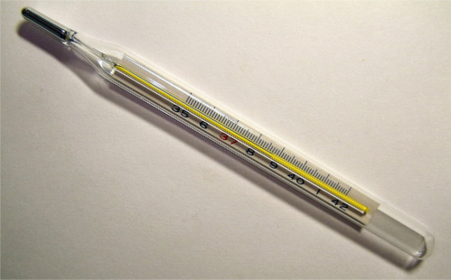

# Temperature

The Astro Pi HAT features a number of sensors, including a temperature sensor.

  

The image above shows a clinical thermometer. You may have been asked to place one in your mouth when you've been ill. Notice that the numbers start at 35, so it's only used for measuring human body temperature. The Astro Pi temperature sensors can measure temperatures from as low as -40 degrees Celsius up to +120 degrees Celsius though, so they are much more versatile than a clinical thermometer. The Astro Pi has two temperature sensors. One is built into the humidity sensor and the other is built into the pressure sensor. You can choose which one to use, or you could use both and average the result.

## What is the temperature?

1. Open **Python 3** from a terminal window as `sudo` by typing:
  
  ```bash
  sudo idel3 &
  ```

1. Enter the following code into a new window:

  ```python
  from astro_pi import AstroPi
  
  ap = AstroPi()
  ap.clear()
  
  temp = ap.get_temperature()
  print(temp)
  ```

1. Select `File > Save` and choose a file name for your program.
1. Select `Run > Run module`.
1. If you see the error `Humidity Init Failed, please run as root / use sudo` (look on the last line of the message in red), it means you haven't followed the instructions above. Close everything and go back to step 1.
1. You should see something like this:

  ```bash
  Humidity sensor Init Succeeded
  28.6293258667
  ```

1. Just before the `print(temp)` line add this line below:

  ```python
  temp = round(temp, 1)
  ```

1. You should now see something like this (without all the numbers after the decimal point):

  ```bash
  Humidity sensor Init Succeeded
  28.6
  ```

1. Try the following functions instead of `get_temperature`.

  - `get_temperature_from_humidity` (uses the humidity sensor, `get_temperature` is a short version of this)
  - `get_temperature_from_pressure` (uses the pressure sensor)

  For example:

  ```python
  from astro_pi import AstroPi
  
  ap = AstroPi()
  ap.clear()
  
  temp = ap.get_temperature_from_pressure()
  temp = round(temp, 1)
  print(temp)
  ```

Your code takes one measurement and then exits.

## Monitoring the temperature

1. It would be good to monitor the temperature as it changes, so let's put our code into a `while` loop and run it again.

  ```python
  while True:
      temp = ap.get_temperature()
      temp = round(temp, 1)
      print(temp)
  ```
  When you run the code the temperature values will scroll up the screen with the latest ones at the bottom.
  
1. Put your thumb over the sensor and hold it there. You should see the measurement start to rise.
1. Blow on it (or give the sensors a short blast from an air duster, if available). The measurement should fall.
1. Press `Ctrl - C` to stop the program.

## Display the temperature on the LED Matrix

Think about how you could show the temperature information on the LED matrix in some way (see the [LED Matrix guide](../inputs-outputs/led-matrix.md) for more information). The obvious choice would be to use the `show_message` function, but, while this would work, there are probably better ways to do it. For example, you could:
  - Use the `clear` function to display some predefined colours based on ranges that the temperature falls in. For example 0 to 5 degrees could be blue?
  - Use the `clear` function to display a single colour but change the brightness of red (0 to 255) based on the measured temperature?
  - Use the `set_pixel` function to display a bar that moves up and down similar to a thermometer.

Below is some starter code for the final suggestion above. This code will display a bar that has a range of 8 degrees Celsius (one degree per horizontal row of LEDs). The maximum it can display is `31` (hard coded; feel free to edit this) and so the minimum is `31 - 8` which is `23`. If the measured temperature goes outside of that range then errors can occur. You can add code to clamp the measured temperature to prevent these errors if you like.

  ```python
  from astro_pi import AstroPi
  
  ap = AstroPi()
  ap.clear()
  
  tmax = 31
  tmin = tmax - 8
  
  while True:
      temp = ap.get_temperature()
      print(temp)
      temp = int(temp) - tmin
      for x in range(0, 8):
          for y in range(0, temp):
              ap.set_pixel(x, y, 255, 0, 0)
          for y in range(temp, 8):
              ap.set_pixel(x, y, 0, 0, 0)
  ```
  
It works by subtracting the minimum value from the measured value which should give a number between 0 and 8. We then use two nested `for` loops. The outer loop is for the `x` axis and the two inner loops are for the `y` axis. We use two loops here because we want to turn all the LEDs below the measurement red with `set_pixel` and those above it off. That way the bar will appear to move up and down the `y` axis following the measured temperature.

Remember that you can use `ap.set_rotation(n)` (where `n` is 0, 90, 180 or 270) at the start of the program just after `ap.clear()` if you want to change the orientation of the bar.

