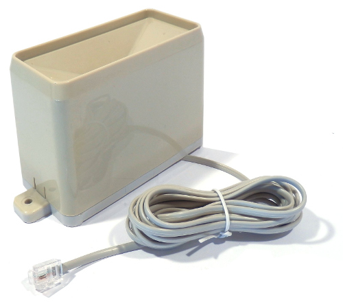

# The Rain Gauge

Here is the rain gauge sensor supplied with the Raspberry Pi Weather Station kit



## How does it work?

We can explore the rain gauge and how it works by removing the bucket, by gently squeezing the clips on either side; the lid should then pop off.


This rain gauge is basically a self-emptying tipping bucket. Rain is collected and channelled into the bucket. Once enough rainwater has been collected the bucket will tip over, the water will drain out from the base, and the opposite bucket will come up into position.

The product [datasheet](https://www.argentdata.com/files/80422_datasheet.pdf) tells us that 0.2794 mm of rain will tip the bucket. We can multiply this by the number of tips to calculate the amount of rainfall.

If you look at the RJ11 plug on the end of the wire attached to the rain gauge, you'll see there are only two wires inside: one red and one green.  Now take a close look at the ridge between the two buckets. Inside this is a small cylindrical magnet that points towards the back wall. Inside the back wall there is a clever piece of electronics called a *reed switch*, pictured below.


The reed switch has two metal contacts inside it which will touch together when under the influence of a magnet. Therefore, electronically, this works in exactly the same way as a button connected to the Raspberry Pi. When the bucket tips, the magnet passes the reed switch, causing it to close momentarily. 

The top of the back wall does come off if you want to see inside; just pull on the flat end gently and it should release. Inside there is a small circuit board that you can remove to examine. In the middle of it you will see the reed switch. Replace the circuit board and back wall lid before continuing. 

## How does the sensor connect?

1. To connect the rain gauge to the weather station board you will need to first have set up the main [weather station box]()
1. Locate the socket on the weather station board marked **RAIN SENSOR** and the corresponding grommet.
1. Unscrew the grommet from the case and thread the rain gauge plug through to the inside of the box.

1. Connect the plug to the socket, and tighten up the grommet.

###When connected the rain gauge uses **GPIO pin 6** (BCM)

## Sample Code

The following program uses a GPIO interupt handler to detect input from the rain guage and convert it to a meaningful measurement which is displayed on screen.

  ```python
  #!/usr/bin/python
  import RPi.GPIO as GPIO

  pin = 6
  count = 0

  def bucket_tipped(channel):
      global count
      count = count + 1
      print (count * 0.2794)

  GPIO.setmode(GPIO.BCM)
  GPIO.setup(pin, GPIO.IN, GPIO.PUD_UP)
  GPIO.add_event_detect(pin, GPIO.FALLING, callback=bucket_tipped, bouncetime=300)
```
